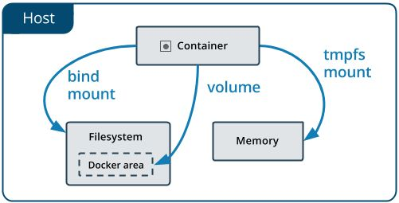

# Add the Storage details
TODO

# Data in Docker

We are in a containerized world.

Everything is separated.

How do we shared/access data ?

# Data in Docker
## Goals
1. How Docker manages data ?
2. Use different type of data storage

# Data in Docker

Docker has 3 options

* Volumes

* Bind Mounts

* tmpfs mount

# Data in Docker



# Data in Docker

## Volumes

* Managed directly by Docker
* Saved in `/var/lib/docker/volumes/` on the host
* System processes can not access data outside Docker
* Recommended by Docker to store data in Docker

# Data in Docker
## Volumes

* User can create its own volumes or instruct Docker to create them when required by the containers or services
* The container see the volume as a directory and the user define the name
* Docker guarantees isolation from the host machine
* A volume can be mounted by many containers at the same time
* If not used it is not destroyed, the user must remove the volume explicitly
* The user can name a volume or Docker create a random name automatically
* A volume can be an *object* in the cloud, the user must use a proper *driver*
* Avoid to increase the size of the container

# Data in Docker

## Bind mounts

* Managed directly by the host OS
* Saved in `/in/your/path/` on the host OS
* System processes or Docker containers can access to the data
* It is possible to override important files or directory on the host OS

# Data in Docker

## Bind mounts

* Files and directory from the host are mounted inside the container at runtime
* Require the target's full path on the host machine
* On demand creation inside the container
* Very performant
* Rely on the host filesystem
* From inside the contianer the user has full access to the filesystem: read/write
* Read/Write from outside the Docker container

# Data in Docker

Expose a *Volume* or *Bind Mount* into the container
```
---volume
```
Docker handles the different betweeen *Volume* and *Bind Mount* from the command line

# Data in Docker

In memory storage
```
---tmpfs
```
This is useful for ephemeral storage required by your software


# Data in Docker
## When use What

| Volume | Bind mount |
|--------|------------|
| Sharing data among containers | Sharing configuration to containers|
| The host lacks a directory structure | Sharing source code and build products |
| Data can not be stored locally (cloud) | Stable direcotry and file structures shared w/ containers|

# Data in Docker
## CLI

```
$ docker volume

Commands:
  create   Create a volume
  inspect  Display detailed information on one or more
           volumes
  ls       List volumes
  prune    Remove all unused volumes
  rm       Remove one or more volumes
```

# Data in Docker
## CLI: Create a volume

Elixir Docker Advanced Course 2018 Storage

```
$ docker volume create edac18-storage

edac18-storage
```


# Data in Docker
## CLI: List volumes


```
$ docker volume ls

DRIVER    VOLUME NAME
local     edac18-storage
```


# Data in Docker
## CLI: Inspecting a volume

```
$ docker volume inspect edac18-storage

[{
  "CreatedAt": "2018-09-20T18:38+00:00",
  "Driver": "local",
  "Labels": {},
  "Mountpoint": "/var/lib/docker/volumes/edac18-storage/
                _data",
  "Name": "edac18-storage",
  "Options": {},
  "Scope": "local"
  }]
```


# Data in Docker
## CLI: Use a volume

Run a container with Ubuntu 18.04 and create a file with something inside
```
$ docker run --rm -v edac18-storage:/data
			 -it ubuntu:18.04 /bin/bash
$ echo $RANDOME > /data/seed
$ exit
```

After closing the container data are store an can be accessed
w/ another container

```
$ docker run --rm -v edac18-storage:/data 
             -it ubuntu:18.04 /bin/bash 
			 -c "cat /data/seed"
```

# Data in Docker
## CLI: Mount points

Load your own directory inside the container

```
$ docker run -v /opt:/host/opt
             --name edac18
			 --rm -it ubuntu:18.04 /bin/bash

```

# Data in Docker
## CLI: Mount points

Load your own directory inside the container

```
$ docker run -v /opt:/host/opt
             --name edac18
			 --rm -it ubuntu:18.04 /bin/bash

```

*Docker does not like relative path*


# Data in Docker
## CLI: Volumes & Mount points

Combine volumes and mount points in a single instance

```
$ docker run -v /opt:/host/opt
             -v edac18-storage:/data
             --name edac18
			 --rm -it ubuntu:18.04 /bin/bash

```

# Data in Docker
## CLI: Share data w/ containers


```
$ docker run -v /opt:/host/opt
             -v edac18-storage:/data
             --name edac18
			 --rm -it ubuntu:18.04 /bin/bash

```
Another container can access to the data at the same time
```
$ docker run --volumes-from edac18
             --name backup
			 --rm -it ubuntu:18.04 /bin/bash

```
*You may notice some lag in updating data, it depends on the underlying Docker filesystem* 


# Data in Docker
## CLI: Share data w/ containers


```
$ docker run -v /opt:/host/opt
             -v edac18-storage:/data
             --name edac18
			 --rm -it ubuntu:18.04 /bin/bash

```
Another container can access to the data and perform a backup automatically
```
$ docker run --volumes-from edac18
             --name backup
			 --rm -it ubuntu:18.04 tar vcz /host/opt/backup.tar.gz /data

```
*You may notice some lag in updating data, it depends on the underlying Docker filesystem* 


# Data in Docker
## CLI: Volumes on the fly

When needed you can even create a Volume at runtime w/o using the explicit `create` command. 


```
$ docker run -v bioinfo:/reads
             -v /opt:/host/opt
             -v edac18-storage:/data
             --name edac18
			 --rm -it ubuntu:18.04 /bin/bash

```

# Data in Docker
## CLI: Volumes on the fly

When needed you can even create a Volume at runtime w/o using the explicit `create` command. 


```
$ docker volume ls

DRIVER    VOLUME NAME
local     edac18-storage
local     bioinfo
```


# Data in Docker
## CLI: Anonymous Volumes 

When needed you can even create a Volume at runtime w/o using the explicit `create` command. 


```
$ docker run -v /anonymous
             -v bioinfo:/reads
             -v /opt:/host/opt
             -v edac18-storage:/data
             --name edac18
			 --rm -it ubuntu:18.04 /bin/bash

```

# Data in Docker
## CLI: Anonymous Volumes

When needed you can even create a Volume at runtime w/o using the explicit `create` command. 


```
$ docker volume ls

DRIVER    VOLUME NAME
local     edac18-storage
local     bioinfo
```

* Once exited from the container, there is no evidence about the anonymous container *

# Data in Docker
## CLI: Anonymous Volumes w/o `--rm`

When needed you can even create a Volume at runtime w/o using the explicit `create` command. 


```
$ docker run -v /anonymous
             -v bioinfo:/reads
             -v /opt:/host/opt
             -v edac18-storage:/data
             --name edac18
			 -it ubuntu:18.04 /bin/bash

```

# Data in Docker
## CLI: Anonymous Volumes w/o `--rm`

When needed you can even create a Volume at runtime w/o using the explicit `create` command. 


```
$ docker volume ls

DRIVER    VOLUME NAME
local     edac18-storage
local     bioinfo
local     8a76g20jc0gcbgf3952gbdnihd253r801skala7898y...
```

*Once exited from the container, there is no evidence about the anonymous container*

# Data in Docker
## Tech notes

Docker *volumes*, *images*, *containers* are capped to a defaul value which is configured at daemon level usually around `10 GB`

```
dm.basesize
```

# Data in Docker
## Tech notes

The `dm.basesize` can be increased but the Docker's daemon must be restared.


# Data in Docker
## Tech notes

The user can run the daemon by hand 
```
$ sudo dockerd --storage-opt dm.basesie=50G
```


# Data in Docker
## Tech notes

The user can increase the size but never decrease it.

If the user specifes a value which is lower than the minumin size of *volumes*, *images*, *containers* Docker will complain with errors.

# Data in Docker
## Tech notes

Usually everything works fine, but may happend that Docker' system dir should be wiped out
```
$ sudo service docker stop

$ sudo rm -rf /var/lib/docker
```
