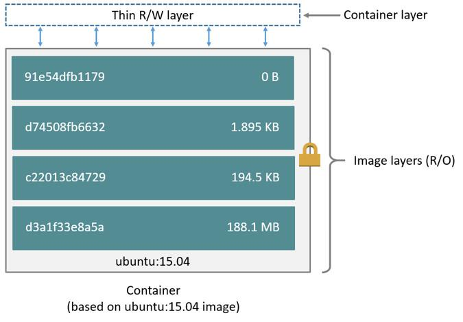
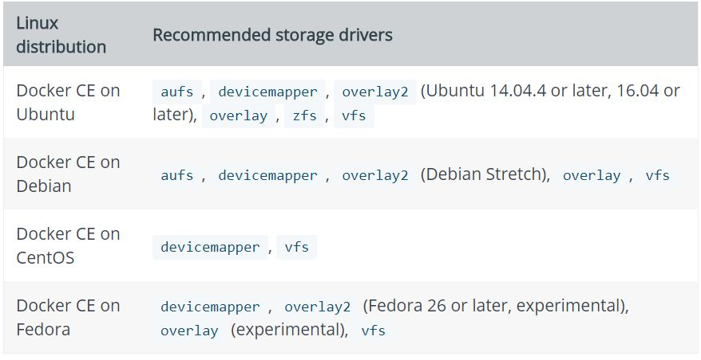
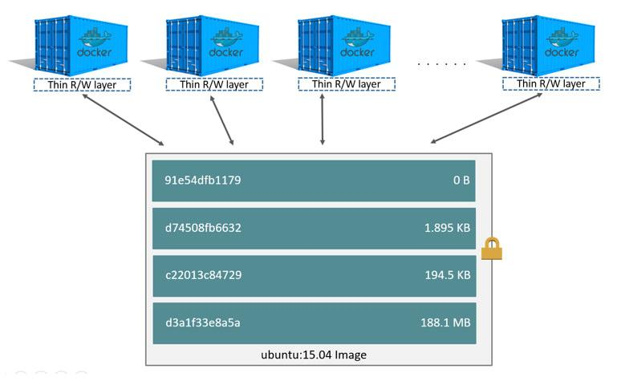

# Docker Storage

Every piece of data in Docker is a layer.

Layers can be (are) resued when possible.



# Docker Storage: Layers

Layers are a sort of snapshots of a filesystem

Usually are in readonly mode

To every new container a *Thin* r/w layer is created. In this layer the container can store its own data.


# Docker Storage: Layers

::: columns

:::: column
```
FROM ubuntu:15.04
COPY ./app
RUN make /app
CMD python /app/app.py
```
::::

:::: column

::::
:::


# Docker Storage: Pull and Storage

```
$ docker pull ubuntu:15.04

15.04: Pulling from library/ubuntu
1ba8ac955b97: Pull complete
f157c4e5ede7: Pull complete
0b7e98f84c4c: Pull complete
a3ed95caeb02: Pull complete
Digest: sha256:5e279a9df07990286cce22e1b0f5b049062
	9ca6d187698746ae5e28e604a640e
Status: Downloaded newer image for ubuntu:15.04
```

# Docker Storage: Pull and Storage
```
$ docker pull ubuntu:18.04
18.04: Pulling from library/ubuntu
124c757242f8: Pull complete
9d866f8bde2a: Pull complete
fa3f2f277e67: Pull complete
398d32b153e8: Pull complete
afde35469481: Pull complete
Digest: sha256:de774a3145f7ca4f0bd144c7d4ffb2931e0
	6634f11529653b23eba85aef8e378
Status: Downloaded newer image for ubuntu:18.04
```

# Docker Storage: Pull and Storage
```
$ docker images -f reference='ubuntu'

REPOSITORY   TAG     IMAGE ID      CREATED      SIZE
ubuntu       18.04   cd6d8154f1e1  2 weeks ago  84.1MB
ubuntu       16.04   2dc7f0e4fc33  2 years ago  122MB
ubuntu       14.04   54060fb55e83  3 years ago  188MB

```

# Docker Storage: Pull and Storage
```
$ sudo find /var/lib/docker -name cd6d81*

/var/lib/docker/image/aufs/imagedb/content/sha256/
	cd6d8154f1e16e38493c3c2798977c5e142be5e5d41403
	ca89883840c6d51762

```

# Docker Storage: Drivers



# Docker Storage: Drivers

**aufs, overlay, overlay2** :  work at file level, memory efficient but layers can grow and become inefficient with high I/O

**devicemapper,btrfs, zfs**: 
		block-level storage, works with write-heavy I/O

**btrfs, zfs**: require a lot of memory

**zfs**: is a good choice for high-density workloads such as PaaS.

**overlay**:  works better with many layers and small files compared to overlay2


# Docker Storage: Drivers

How to choose the driver:

* Perform tests based on your hardware with your sysadmin
* Check the stability of the driver and decide your stability policy
* If you have an expertise in house use it.
* Some drivers works best on some Linux distro
* Perform tests on real workloads

# Docker Storage: Divers

*!!! WARING !!!*

You can not mix drivers

Each dirver has its set of images and containers

Migration is not possible


# Docker Storage: Layers

Layers are a sort of snapshots of a filesystem

Usually are in readonly mode

To every new container a *Thin* r/w layer is created. In this layer the container can store its own data.


# Docker Storage: Thin layers





# Docker Storage: Think layers and Data

A writable container layer is created every time a container
start and it is where data are stored

When a container is not running:

* Data does not persist
* Sharing data with other container is very very ... very complicated
* Your host machine own the writable layer, moving the layer is not that simple
* Not the best opton for high I/O, layers can be unsincronized 

# Docker Storage: Thin layers

```
$ docker run -dit --name my_container_1
           acme/my-final-image:1.0 bash

c36785c423ec7e0422b2af7364a7ba4da6146cbba7981a0951
	fcc3fa0430c409


$ docker run -dit --name my_container_2 
           acme/my-final-image:1.0 bash
		   
dcad7101795e4206e637d9358a818e5c32e13b349e62b00bf0
	5cd5a4343ea513

...
```
# Docker Storage: Thin layers, where are ?

```
$ sudo du -shL /var/lib/docker/containers/*
32K /var/lib/docker/containers/1a174fc216cccf18ec7
	d4fe14e008e30130b11ede0f0f94a87982e310cf2e765
32K /var/lib/docker/containers/1e7264576d78a3134fb
	af7829bc24b1d96017cf2bc046b7cd8b08b5775c33d0c
32K /var/lib/docker/containers/38fa94212a419a082e6
	a6b87a8e2ec4a44dd327d7069b85892a707e3fc818544
32K /var/lib/docker/containers/c36785c423ec7e0422b
	2af7364a7ba4da6146cbba7981a0951fcc3fa0430c409
32K /var/lib/docker/containers/dcad7101795e4206e63
	7d9358a818e5c32e13b349e62b00bf05cd5a4343ea513 
```

# Docker Storage: Container and Size

Running a plain Ubuntu 18.04
```
$ docker run ubuntu -it ubuntu:18.04 bash
```
*Note* detach from the container using `Ctrl-P` + `Ctrl-Q`

# Docker Storage: Container and Size

```
$ docker ps -s
```
| CONTAINER ID | IMAGE        | SIZE                |
|--------------|--------------|---------------------|
| 0e7438744a0a | ubuntu:18.04 | 0B (virtual 84.1MB) |


# Docekr Storage: Container and Size

Updating the `apt` database
```
$ docker attach 0e74
$ apt update
```
| CONTAINER ID | IMAGE        | SIZE                   |
|--------------|--------------|------------------------|
| 0e7438744a0a | ubuntu:18.04 | 41.7MB (virtual 126MB) |

# Docekr Storage: Container and Size

Upgrading the `apt` database
```
$ apt upgrade
```
| CONTAINER ID | IMAGE        | SIZE                   |
|--------------|--------------|------------------------|
| 0e7438744a0a | ubuntu:18.04 | 42.6MB (virtual 127MB) |


# Docekr Storage: Container and Size

Installing `wget`
```
$ apt install wget
```
| CONTAINER ID | IMAGE        | SIZE                   |
|--------------|--------------|------------------------|
| 0e7438744a0a | ubuntu:18.04 | 49.1MB (virtual 133MB) |
