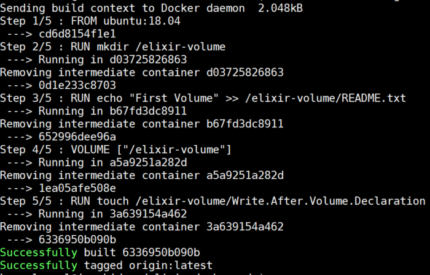

# Dockefile: why?

A docker can be created by hand

* pull an image
* start a container
* modify the container
* commit the changes 

this is more or less the process for creating a reusable container *an Image*

# Dockerfile: why?

By *hand* is good for practicing or testing but is very bad for 

* reproducibility
* automation
* dependencies

# Dockerfile: why?

By *hand* is good for practicing or testing but is very bad for 

**reproducibility**: lost the history of the commands that create the final image

* automation

* dependencies

# Dockerfile: why?

By *hand* is good for practicing or testing but is very bad for 

* reproducibility

**automation**: images are lost because some disaster and eveything was on a local machine

* dependencies

# Dockerfile: why?

By *hand* is good for practicing or testing but is very bad for 

* reproducibility

* automation

**dependencies**: images are build from other images and something must be changed in the original image

# Dockerfile: what is it?

A simple text files with all the instructions for

* start (PULL) from a (public) Linux distribution
* install software
* configure the installation
* configure the container for running automatically

# Dockerfile: what is it?

The most minimal `Dockerfile`

```
FROM ubuntu:18.04
```

*Note* by convention `Dockerfile` is the name to use for the file containing the instructions.

# Dockefile: how to use it

A `Dockerfile` can be used for building a new image

```
 $ docker build -t origin .
 Sending build context to Docker daemon  2.048kB
 Step 1/1 : FROM ubuntu:18.04
  ---> cd6d8154f1e1
  Successfully built cd6d8154f1e1
  Successfully tagged origin:latest
```
A new image is created with the `sha256` `cd6d8154f1e1` called `origin` and the version, in this case by default `Docker` assign the tag `latest`

# Dockerfile: FROM

Start from a Linux distribution or previous *installations*/images

```
FROM <image> [AS <name>]

FROM <image>[:<tag>] [AS <name>]

FROM <image>[@<digest>] [AS <name>]
```

# Dockerfile: LABEL
Metadata are useful in order to describe the image, making it more consumable by others

`LABEL <key>=<value> <key>=<value> <key>=<value> ...`
```
LABEL org.ingm.group="Your Boss name"
LABEL maintainer="Bonnal Raoul J.P. <bonnal@ingm.org>"
LABEL project="Elixir Test"
LABEL description="Dockerfile example \
with multiple lines."
LABEL version="1.2"
 
LABEL maintainer=”bonnal@ingm.org”
```
User is free to use any kind of `key=val` convention but the *reverse DNS* notation.


# Dockerfile: ENV

Environment variables can be set inside the container

```ENV <key> <value>
ENV <key>=<value> ...
```

```
ENV software="samtools" description=A\ great\ piece\ of\ software
    author=someone
```	
and
	
```
ENV software samtools
ENV description A great piece of software
ENV author someone
```
these variable are available during the building process and when the container is running

# Dockerfile: WORKDIR

Sets the working directory for the following *instructions*

```
ENV MYSUBDIR mytmp
RUN mkdir /opt/$MYSUBDIR
WORKDIR /opt/$MYSUBDIR
RUN pwd
```

Works for `RUN`, `CMD`, `ENTRYPOINT`, `COPY` and `ADD`

# Dockerfile: injecting files

To fully customize the image, external files can be included. To achieve this `Docker` provides two different tools

* `ADD`
* `COPY`

# Dockerfile: ADD


```
ADD [--chown=<user>:<group>] <src>... <dest>
ADD [--chown=<user>:<group>] ["<src>",... "<dest>"]
```
* Digest URLs, download
* Unpack archives (identity, gzip, bzip2 or xz)
* Does not perform authentication
* At every build it is re excuted

# Dockerfile: COPY

```
COPY [--chown=<user>:<group>] <src>... <dest>
COPY [--chown=<user>:<group>] ["<src>",... "<dest>"]
```
* Relative path outside of context does not work
* Works only with local files or directory
* Can copy files from source location to a previous build stage “FROM“
* NO URLs
* NO auto unpacking

# Dockerfile: SHELL

When commands must be run with a different shell

```
SHELL ["executable", "parameters"]
```

# Dockerfile: USER

Set the USER to use during when the containers run.
It also set the user for RUN, CMD, ENTRYPOINT following the declaration of USER

```
USER <user>[:<group>]
USER <UID>[:<GID>]
```

# Dockerfile: RUN

To customise the installation the user must execute commands.

The commands are run inside a default shell `/bin/sh -c`

Use the `SHELL` clause to change the shell for the following `Dockerfile`

When a `RUN` succeed Docker will write a layer.


# Dockerfile: RUN

`RUN` have two forms:

```
RUN apt-get update
```
or use a more explicit form where parameters are passed in a sort of `JSON` notation

``` 
RUN ["apt-get", "update"]
```

The JSON form does not create a shell for the command, so variable can not be substituted. To use the shell substitution call the shell first.

# Dockerfile: RUN

A `RUN` command can span multiple lines

`RUN apt-get install -y wget git python3.6 `

```
RUN apt-get install -y wget \
                       git \
					   python3.6
```

# Dockerfile: RUN

A `RUN` command can be made by multiple commands

```
RUN comamnd1 && command2
```

The `RUN` will pass and create a layer only if it succeed. Otherwise, Docker will report the original error.

# Dockerfile: RUN

Combining commands and spanning the commands on multiple lines helps in readibility and building complex configurations.

```
RUN apt-get update &&\
    apt-get install -y wget 
```
# Dockerfile: RUN

Combining commands and spanning the commands on multiple lines helps in readibility and building complex configurations.

```
RUN apt-get update &&\
    apt-get install -y wget \
	                   git \
					   python3.6
```

# Dockerfile: ENTRYPOINT
Defines a container that runs as an executable

Forms:

**exec**: preferred

	ENTRYPOINT ["executable", "param1", "param2"]

**shell**: 

	ENTRYPOINT command param1 param2


# Dockerfile: CMD
Defines the default behaviour for the container.

Forms:

**exec**: preferred

	CMD ["executable","param1","param2"]

**default parameters to ENTRYPOINT**:

	CMD ["param1","param2"]

**shell**:

	CMD command param1 param2

# Dockerfile: VOLUME
It is possible to embed the volume definition at build time.

Any change, at build time, after the definition will be discarded.

`VOLUME ["/path","..."]`

`VOLUME /path_a /path_b`

Volumes are:

* created automatically at run time
* can be shared between containers with `--volumes-from`
* are anonymous at runtime
* can be inspected looking at `/var/lib/docker/volumes`

# Dockerfile: VOLUME

Example of creating a `VOLUME` 

```
FROM ubuntu:18.04
RUN mkdir /opt/elixir-volume
RUN echo "This is a file with a foo text" > /opt/elixir-volume/README.txt
VOLUME ["/opt/elixir-volume"]
```

# Dockerfile: context

Context defines what is visibleOA at the build time by Docker.
Data inside the `context` are copied in a temporary place where the building process is working. The building process can see only data in that temporary place. 

This process of `building the context` can take a lot of time if files are big and many.

Avoid:

* huge files
* temporary or working file
* backup 

in the context.

A lean `context` means quick build.

# Dockerfile: validation

A `Dockerfile` is a text file and Docker keep tracks of changes in the file.

Most of the *instructions* generate a layer. 

Changes to the text are invalidaing all the following *instructions* and they will be re-executed.

# Dockerfile: example

```
FROM ubuntu:18.04

LABEL org.ingm.group="Your Boss name"
LABEL maintainer="Bonnal Raoul J.P. <bonnal@ingm.org>"
LABEL project="Elixir Test"
LABEL description="Dockerfile example"
LABEL version="1.2"

RUN apt-get update &&\
    apt-get install -y wget \
	                   git \
					   python3.6
```

# Dockerfile: bulding

`$ docker build -t origin .`

`$ docker build -t origin Dockerfile .`

`$ docker build -t origin -f /absolute/path/Dockerfile .`

# Dockerfile: building


