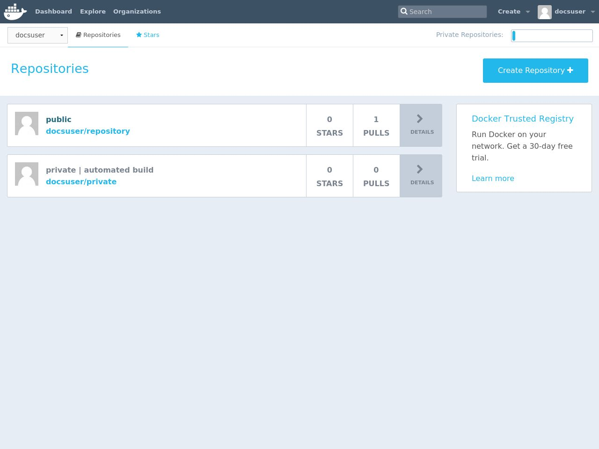

# Private registry

A local Docker registry can be useful in many situations

* images contain private data or informations
* need to test specific applications
* speed and reliability
* other applications require the service

# Private registry

A local Docker registry can be useful in many situations

* images contain private data or informations
  * passwords
  * user names
  * network configurations
  * mount points
* need to test specific applications
* speed and reliability
* other applications require the service

# Private registry

A local Docker registry can be useful in many situations

* images contain private data or informations
* need to test specific applications
* speed and reliability
  * good internet connection
  * not limited by number of images or containers
  * lots of disk space
* other applications require the service

# Private registry

A local Docker registry can be useful in many situations

* images contain private data or informations
* need to test specific applications
* speed and reliability
* other applications require the service
  * workflow managers may use Docker container for running the pipelines
  * other container technologies depends on custom Docker images

# Docker Registry: run

Run an insecure registry

```
$ docker run -d -p 5000:5000 \
           --restart=always \
		   --name registry registry:2
```

*!!! WARNING !!!* this is an insecure registry.

# Docker Registry: run

Run an insecure registry

```
$ docker run -d -p 5000:5000 \
           --restart=always \
		   --name registry registry:2
```
This registry runs on the localhost

and

# Docker Registry: run

Run an insecure registry

```
$ docker run -d -p 5000:5000 \
           --restart=always \
		   --name registry registry:2
```
This registry runs on the localhost

and

is INSECURE but it's OK for testing.

# Docker Registry: run

Check if the registry is running

```
$docker ps
CONTAINER ID  IMAGE      COMMAND
d37dd351dd30  registry:2 "/entrypoint.sh /e..."

CREATED    STATUS    PORTS                  
15 min ago Up 15 min 0.0.0.0:5000->5000/tcp 

NAMES
registry
```

# Docker Registry: load an image 

Get an image from the net

```
$ docker pull ubuntu:18.04
```

# Docker Registry: load an image 

Tag the image with a proper name
```
$ docker tag ubuntu:18.04 \
    localhost:5000/user/mydistro:18.04
    
```


# Docker Registry: load an image

Push the image to the local repository

```
$ docker push \
  localhost:5000/user/mydistro:18.04
```

# Docker Registry: list images

Docker works with HTTP API (v2)

```
$ curl -v http://localhost:5000/v2/_catalog
```

[documentation](https://docs.docker.com/registry/spec/api/)

# Docker Registry: list images

```
< HTTP/1.1 200 OK
< Content-Type: application/json; charset=utf-8
< Docker-Distribution-Api-Version: registry/2.0
< X-Content-Type-Options: nosniff
< Date: Tue, 25 Sep 2018 13:36:04 GMT
< Content-Length: 52
<
{"repositories":["gianluca/ubuntu","raoul/ubuntu"]}
* Connection #0 to host localhost left intact
```

# Docker Registry: get tags

```
$ curl http://localhost:5000/raoul/ubuntu/tags/list
{"name":"raoul/ubuntu","tags":["18.04"]}
```

# Docker Registry: get details

```
$ curl http://localhost:5000/raoul/ubuntu/manifests/18.04
```


# Docker Hub: public registry


# Docker Hub: public registry



# Docker Hub: public registry

* register a new user to [Docker Hub](https://hub.docker.com/)
* `export DOCKER_ID_USER="username"`
* `docker login`
* `docker tag imageX $DOCKER_ID_USER/imageX`
* `docker push $DOCKER_ID_USER/imageX`
